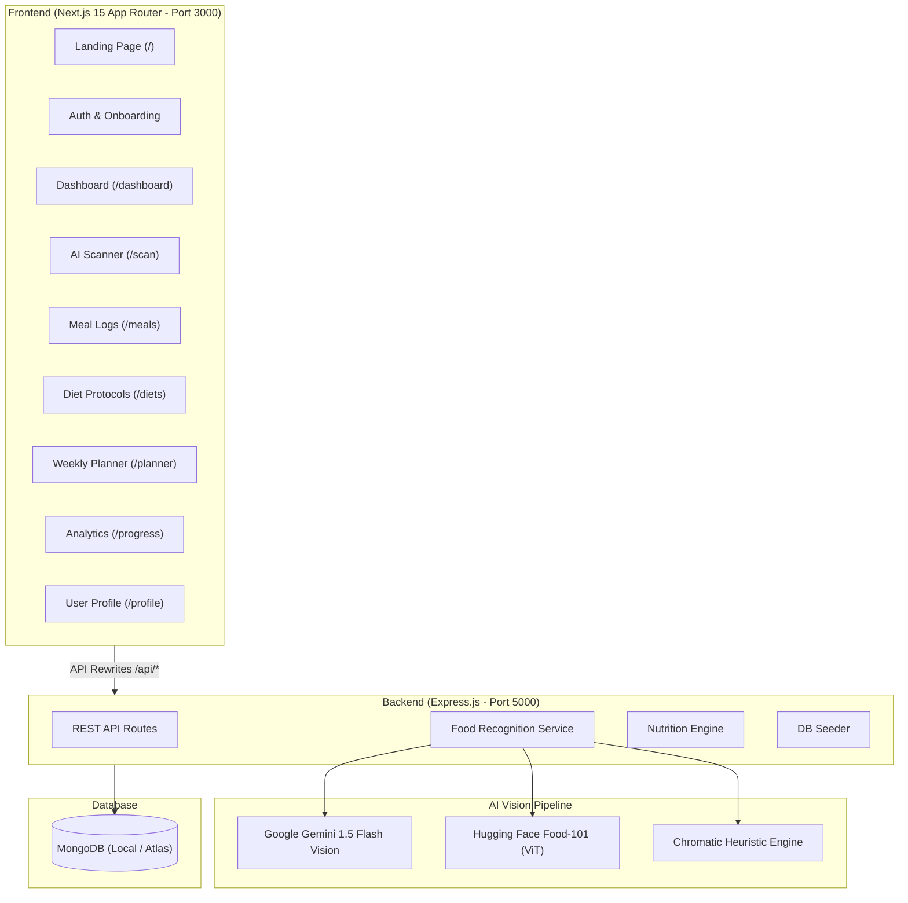

# 🥗 NutriLens — AI Fitness & Nutrition Platform

[](https://nextjs.org/)
[](https://react.dev/)
[](https://tailwindcss.com/)
[](https://expressjs.com/)
[](https://www.mongodb.com/)
[](https://ai.google.dev/)

**NutriLens** is an AI-powered health-tech SaaS web application that enables users to photograph meals, instantly break down calories & macronutrients using multimodal computer vision, track daily nutrition, follow curated diet protocols, plan weekly meals, and monitor health analytics.

---

## 🏗️ Architecture Overview



---

## ✨ Features Completed (কি কি কাজ করা হয়েছে)

### 1. 📸 Zero API Key On-Device Vision + 100+ Vegetable Database & Active Visual Memory
* **On-Device Vision**: Runs browser-native TensorFlow.js MobileNetV2 + chromatic pixel extractor without needing external paid API keys.
* **100+ Vegetable Nutrition Dataset**: USDA & ICMR calibrated nutritional database with bilingual (Bengali & English) names and aliases.
* **🧠 Active Visual Memory (dHash)**: If a user corrects or types a vegetable name manually, the system computes a 64-bit gradient perceptual difference hash and stores it in MongoDB and local cache. Future scans of this picture match instantly with 100% confidence!

### 2. 📊 Clinical AI Nutritionist Dashboard
* **Clean Slate Fresh State**: Initial dashboard starts at clean 0 kcal / 0 dummy meals for new users.
* **Personalized Hydration**: Body weight & height based daily water target (Liters & glasses) with 1-click water loggers.
* **Exercise & NEAT Non-Exercise Habits**: Workout durations + 8,000-10,000 steps and post-meal walk alternatives.
* **30-Day Predictive Fat Loss Forecast**: Live 30-day weight projection based on daily caloric deficit vs TDEE.
* **Mobile Responsive Drawer**: Accessible Sidebar drawer with hamburger button for small screens and mobile devices.

### 3. 🍽️ Comprehensive Meal Logging & Tracking
* Log breakfast, lunch, dinner, and snacks.
* Auto-calculation of total calories and macros from individual meal items.
* Full CRUD endpoints (`GET`, `POST`, `DELETE`) with detailed meal breakdown views (`/meals/[id]`).

### 4. 🥗 Curated Diet Protocols
* 7 built-in scientific diet plans (Mediterranean, High Protein Gym, Ketogenic, Intermittent Fasting, Clean Eating, DASH, Plant-Based).
* Deep breakdown: macro ratios, health benefits, allowed foods, foods to limit, and a sample meal day plan.
* **"Adopt Protocol"** capability to customize user profile targets.

### 5. 📅 Weekly Meal Planner
* Drag-and-plan meal schedule for Monday through Sunday.
* Add planned meal slots with preset or custom calories and macros.
* Integrated with user goals.

### 6. 📈 Progress, Weight & Nutrition Analytics
* Interactive Recharts visualizations for weight tracking over time.
* Upsert weight logs per date with automatic profile synchronization.
* 30-day nutrition history aggregation from meal history.

### 7. 👤 User Profile & Custom Nutrition Targets
* Detailed physical metrics (height, weight, target weight, activity level, dietary preferences, allergies).
* Dynamic macro and calorie goal setting (calories, protein, carbs, fat, fiber, water targets).

### 8. 🔐 Authentication & Onboarding
* Email login, registration with body metrics, and password recovery pages.
* Interactive multi-step onboarding wizard for personalized goal calculation.
* Global state management powered by **Zustand**.

### 9. 🎨 Premium Glassmorphic UI/UX Design System
* Modern dark-mode health-tech aesthetic with subtle emerald/teal glows.
* 11+ reusable custom UI components: Button, Card, Badge, Input, Select, Modal, ProgressBar, ProgressRing, Skeleton, EmptyState, ErrorState.
* 100% responsive: Desktop Sidebar + Mobile Bottom Navigation Bar + TopBar.

### 10. 📦 Massive Seed Data Script
* Comprehensive 727-line seeder (`npm run seed`) populating demo users, comprehensive food items, sample meals, scans, weight logs, and diet plans.

---

## 💻 Tech Stack

| Domain | Technology |
|---|---|
| **Frontend** | [Next.js 15](https://nextjs.org/) (App Router), [React 19](https://react.dev/), [TypeScript](https://www.typescriptlang.org/) |
| **Styling** | [Tailwind CSS v4](https://tailwindcss.com/), Glassmorphism, CSS Variables |
| **State Management** | [Zustand 5](https://github.com/pmndrs/zustand) |
| **Icons & Charts** | [Lucide React](https://lucide.dev/), [Recharts](https://recharts.org/) |
| **Backend** | [Node.js](https://nodejs.org/), [Express.js](https://expressjs.com/) |
| **Database** | [MongoDB](https://www.mongodb.com/) & [Mongoose 8](https://mongoosejs.com/) |
| **AI Vision Models** | Google Gemini 1.5 Flash Vision, Hugging Face Food-101 |
| **Deployment** | [Vercel](https://vercel.com/) (Frontend) + [Render](https://render.com/) (Backend) + [MongoDB Atlas](https://www.mongodb.com/atlas) (Cloud DB) |

---

## 🗄️ Database Models (Mongoose Schemas)

1. **`User`**: Profile information, biometrics, activity level, dietary preferences, allergies, and embedded `goal` object.
2. **`Food`**: Global nutrition database items with serving sizes, macros, tags, and category.
3. **`Meal`**: Logged meals with embedded `items[]`, timestamps, total calories/macros, and photos.
4. **`FoodScan`**: AI vision analysis history, confidence levels, detected item breakdowns, and notes.
5. **`DietPlan`**: Complete diet protocols with macro ratios, descriptions, benefits, and sample days.
6. **`PlannedMeal`**: Day-of-week (0-6) planned meal slots with macro targets.
7. **`WeightLog`**: Daily weight entries with date index and notes.

---

## 🔌 API Endpoints Summary

| Method | Route | Description |
|---|---|---|
| `GET` | `/api/health` | Service health & MongoDB connection status |
| `POST` | `/api/auth/register` | Register new user profile |
| `POST` | `/api/auth/login` | Email-based login |
| `GET` | `/api/auth/me` | Fetch active user profile |
| `GET` | `/api/users/:id` | Get user details (`/api/users/current` supported) |
| `PUT` | `/api/users/:id` | Update profile information |
| `PUT` | `/api/users/:id/goal` | Update calorie and macro goals |
| `GET` | `/api/meals` | List meals (supports `userId` & `date` filters) |
| `GET` | `/api/meals/:id` | Get meal by ID |
| `POST` | `/api/meals` | Create meal (auto-calculates item totals) |
| `DELETE` | `/api/meals/:id` | Delete meal log |
| `GET` | `/api/foods` | Search food items with category and text filters |
| `POST` | `/api/foods` | Create new food item |
| `POST` | `/api/scans/analyze` | Run AI vision food recognition on image base64 |
| `GET` | `/api/scans` | Get scan history |
| `POST` | `/api/scans` | Save scan result |
| `GET` | `/api/progress/weight` | Get weight history |
| `POST` | `/api/progress/weight` | Log weight entry |
| `GET` | `/api/progress/nutrition` | Get aggregated nutrition history |
| `GET` | `/api/diets` | List all diet protocols |
| `GET` | `/api/diets/:slug` | Get single diet plan details |
| `POST` | `/api/diets/adopt` | Adopt diet protocol to user profile |
| `GET` | `/api/planner` | Get weekly planned meals |
| `POST` | `/api/planner` | Add planned meal slot |
| `DELETE` | `/api/planner/:id` | Remove planned meal slot |

---

## 📱 Frontend Pages (15 Routes)

| Page | Path | Description |
|---|---|---|
| **Landing** | `/` | Hero section, feature previews, protocol showcase |
| **Login** | `/login` | Authentication form |
| **Register** | `/register` | Full biometric registration |
| **Forgot Password** | `/forgot-password` | Password recovery page |
| **Onboarding** | `/onboarding` | Interactive setup wizard |
| **Dashboard** | `/dashboard` | Daily calorie, macro ring & meal log overview |
| **AI Scanner** | `/scan` | Live camera / file upload AI food scanner |
| **Scan Detail** | `/scan/[id]` | Historical scan breakdown view |
| **Meals List** | `/meals` | Complete meal history with date filtering |
| **Meal Detail** | `/meals/[id]` | Individual meal breakdown |
| **Diet Plans** | `/diets` | Browse 7 scientific diet plans |
| **Diet Detail** | `/diets/[slug]` | Full diet protocol breakdown & adoption |
| **Weekly Planner** | `/planner` | Mon-Sun weekly meal scheduling |
| **Progress** | `/progress` | Weight & macro charts via Recharts |
| **Profile** | `/profile` | Profile info & nutrition goal manager |

---

## 🚀 Getting Started (Local Development)

### 1. Prerequisites
- **Node.js** v18+ & **npm**
- **MongoDB** running locally on port `27017` (or MongoDB Atlas URI)

### 2. Clone & Install Dependencies
```bash
git clone https://github.com/Nishat009/nutrilens.git
cd nutrilens

# Install root, server, and web dependencies
npm install
npm --prefix server install
npm --prefix web install
```

### 3. Configure Environment Variables

**Server Environment** (`server/.env`):
```env
PORT=5000
MONGODB_URI=mongodb://127.0.0.1:27017/nutrilens
NODE_ENV=development

# Optional AI Vision keys
GEMINI_API_KEY=your_gemini_api_key_here
HF_TOKEN=your_huggingface_token_here
```

**Web Environment** (`web/.env.local` - Optional for local dev):
```env
NEXT_PUBLIC_API_URL=http://localhost:5000
```

### 4. Seed Database (Optional but Recommended)
Populate the database with sample users, nutrition database, diet protocols, and sample logs:
```bash
npm run seed
```

### 5. Run Concurrently (Frontend + Backend)
```bash
npm run dev
```

* **Frontend**: [http://localhost:3000](http://localhost:3000)
* **Backend API**: [http://localhost:5000](http://localhost:5000)
* **API Health Check**: [http://localhost:5000/api/health](http://localhost:5000/api/health)

---

## ☁️ Deployment

Check out the full step-by-step production deployment guide in [DEPLOYMENT.md](DEPLOYMENT.md).

* **Frontend**: Deploy `web/` to **Vercel** with environment variable `NEXT_PUBLIC_API_URL`.
* **Backend**: Deploy `server/` to **Render** using the provided `render.yaml`.
* **Database**: **MongoDB Atlas** M0 Cluster.

---

## 🔮 Future Roadmap / Next Improvements

- [ ] **JWT Authentication & Bcrypt**: Secure token-based auth and password hashing.
- [ ] **Auth Middleware**: Route-level protection on backend endpoints.
- [ ] **Cloud Image Storage**: Direct upload to Cloudinary / AWS S3 instead of Base64 strings.
- [ ] **Live Barcode Scanning**: OpenFoodFacts API integration for packaged foods.
- [ ] **Automated Testing**: Unit & integration tests with Jest/Supertest/Playwright.
