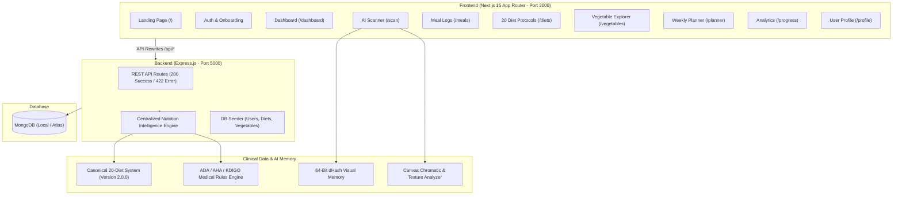

# 🥗 NutriLens — Multimodal Vision-Based AI Nutrition & Clinical Health Platform

[](https://nextjs.org/)
[](https://react.dev/)
[](https://tailwindcss.com/)
[](https://expressjs.com/)
[](https://www.mongodb.com/)
[](https://js.tensorflow.org/)

**NutriLens** is an AI-powered clinical health-tech platform that combines on-device neural computer vision, perceptual hashing visual memory, 20 evidence-graded diet protocols, and medical safety guardrails aligned with ADA, AHA, and KDIGO guidelines.

---

## 🏗️ Architecture Overview



---

## ✨ System Modules & Features

### 1. 📸 Multi-Candidate AI Food Scanner (`/scan`)
* **On-Device Vision**: Runs browser-native TensorFlow.js MobileNetV2 + canvas chromatic histogram analysis with 0 paid external API keys.
* **1-Tap Similar Candidate Chips**: Suggests visually and family-similar candidates (e.g. Tomato, Red Bell Pepper, Red Apple, Cherry Tomato) allowing instant 1-click swap and live macro recalculation.
* **🧠 Active Visual Memory (`dHash`)**: 64-bit perceptual difference hashing permanently remembers user corrections and custom selections.
* **5-Tier Clinical Compliance**:
  * 🟢 `SAFE` — Protocol compliant.
  * 🟡 `CAUTION` — Mindful portion or cooking preparation advised (e.g. moderate white rice in diabetes, raw brassicas in thyroid).
  * 🟠 `LIMIT` — Large portions discouraged (e.g. $\ge 200\text{g}$ white rice in diabetes, large meat/fish in gout).
  * 🔴 `AVOID` — Strict allergen or medical conflict.
  * 🟣 `PROFESSIONAL_REVIEW` — Automated prescription blocked; requires healthcare professional supervision (e.g. CKD + High Protein).
* **Easy Re-Scan Controls**: Glowing top-bar, floating image, and bottom action Re-Scan buttons.

---

### 2. 🥗 20 Canonical Clinical & Hormonal Diet Protocols (`/diets`, `/diets/[slug]`)
* **Canonical Catalog (Version 2.0.0)**: PCOS, Hypothyroidism, Insulin Resistance, DASH Cardio, Low-Purine Gout, Fatty Liver Care, Fertility Prep, Targeted Deshi Keto, Hormone-Safe Fasting 14/10, etc.
* **Evidence Profiles**: Physiological mechanism summaries and evidence levels (`strong`, `moderate`, `traditional`).
* **Range-Based Macros**: Dynamic target ranges (`protein_percent: { min, max }`) tailored to each user's TDEE.
* **Pre-Adoption Safety Clearance**: Automatically checks contraindications (CKD, pregnancy, underweight BMI) before allowing protocol adoption.

---

### 3. 📊 AI Nutritionist Dashboard (`/dashboard`)
* **Clean State Initialization**: Starts with 0 dummy meals for new users.
* **30-Day Estimated Energy-Balance Change**: Theoretical weight forecast ($7,700 \text{ kcal} = 1\text{ kg fat}$) with clinical educational disclaimers.
* **Personalized Hydration**: Body weight & height based daily water target (liters & glasses).
* **NEAT Activity Tracker**: Step pacing and non-exercise daily movement habits.

---

### 4. 🥦 Verified Vegetable Nutrition Explorer (`/vegetables`)
* 105+ curated South Asian and international botanical items.
* Dynamic category filtering directly populated from MongoDB.
* Standardized to 100g raw edible baseline with USDA & ICMR data.

---

### 5. 📅 Planner, Meal Logs & Analytics
* **Weekly Planner (`/planner`)**: Drag-and-plan 7-day schedule.
* **Meal Logs (`/meals`, `/meals/[id]`)**: Detailed macro breakdown per meal.
* **Progress (`/progress`)**: Weight logs, interactive Recharts trend graphs, and 30-day nutrition history.

---

## 🚀 Quick Setup & Run Instructions

### 1. Clone & Install Dependencies
```bash
# Install server dependencies
cd server
npm install

# Install web dependencies
cd ../web
npm install
```

### 2. Environment Configuration
Create `server/.env`:
```env
PORT=5000
MONGODB_URI=mongodb://localhost:27017/nutrilens
JWT_SECRET=your_secret_key_here
NODE_ENV=development
```

Create `web/.env.local`:
```env
NEXT_PUBLIC_API_URL=http://localhost:5000
```

### 3. Seed Database
```bash
cd server
node src/seed.js
```

### 4. Run Development Servers
```bash
# Start Backend (Port 5000)
cd server
npm run dev

# Start Frontend (Port 3000)
cd ../web
npm run dev
```

### 5. Run Nutrition Intelligence Tests
```bash
cd server
node src/test-intelligence.js
```
