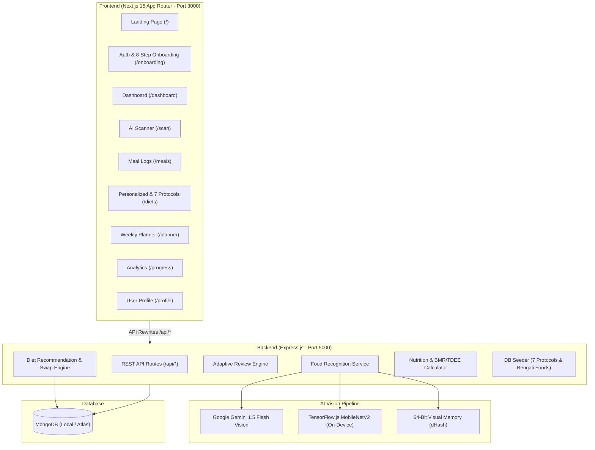

# 🥗 NutriLens — AI Fitness & Nutrition Platform

[](https://nextjs.org/)
[](https://react.dev/)
[](https://tailwindcss.com/)
[](https://expressjs.com/)
[](https://www.mongodb.com/)
[](https://ai.google.dev/)

**NutriLens** is a comprehensive, clinically grounded AI health-tech SaaS web application. It combines multimodal computer vision for instant meal breakdown, evidence-based scientific diet protocols, an authentic Bangladeshi food adaptation engine, an 8-step personalized nutrition recommendation engine, interactive 7-day meal schedules with household portion guides, one-click food swaps, and a 2–3 week adaptive progress check-in system.

---

## 🏗️ Architecture Overview


```mermaid
graph TB
    subgraph Client ["Frontend (Next.js 15 App Router - Port 3000)"]
        LP["Landing Page (/)"]
        AUTH["Auth & 8-Step Onboarding (/onboarding)"]
        DASH["Dashboard (/dashboard)"]
        SCAN["AI Scanner (/scan)"]
        MEALS["Meal Logs (/meals)"]
        DIETS["Personalized & 7 Protocols (/diets)"]
        PLANNER["Weekly Planner (/planner)"]
        PROGRESS["Analytics (/progress)"]
        PROFILE["User Profile (/profile)"]
    end

    subgraph Server ["Backend (Express.js - Port 5000)"]
        API["REST API Routes (/api/*)"]
        DIET_ENG["Diet Recommendation & Swap Engine"]
        ADAPT_ENG["Adaptive Review Engine"]
        RECOG["Food Recognition Service"]
        NUTRI["Nutrition & BMR/TDEE Calculator"]
        SEED["DB Seeder (7 Protocols & Bengali Foods)"]
    end

    subgraph AI ["AI Vision Pipeline"]
        GEMINI["Google Gemini 1.5 Flash Vision"]
        TFJS["TensorFlow.js MobileNetV2 (On-Device)"]
        DHASH["64-Bit Visual Memory (dHash)"]
    end

    subgraph DB ["Database"]
        MONGO[("MongoDB (Local / Atlas)")]
    end

    Client -->|API Rewrites /api/*| Server
    Server --> MONGO
    RECOG --> GEMINI
    RECOG --> TFJS
    RECOG --> DHASH
    DIET_ENG --> MONGO
```

---

## ✨ Features & Capabilities

### 1. 🧬 Personalized Diet Recommendation Engine & 7-Day Meal Planner
- **8-Step Comprehensive Onboarding Flow (`/onboarding`)**:
  1. *Basic Profile*: Age, Biological Sex, Height (with instant cm/ft unit toggle), Current Weight, Target Weight, Optional Waist circumference.
  2. *Primary Goal & Pacing*: 8 primary goals (Lose Weight, Reduce Waist / Belly Fat, Build Muscle, Body Recomp, Maintain, General Health, Blood Sugar, Blood Pressure) + Pacing (Slow & Sustainable, Moderate, Faster).
  3. *Physical Activity Level*: Sedentary to Heavy Athlete with TDEE multiplier calibration.
  4. *Health Conditions & Clinical Safety Alerts*: 15+ conditions (Diabetes, Prediabetes, Hypertension, PCOS, Thyroid, High Cholesterol, Fatty Liver, Kidney, Liver, GERD, IBS, Anemia, Pregnancy) with doctor consultation advisories and safe deficit floor enforcement (minimum 1,200 kcal/day for women, 1,500 kcal/day for men).
  5. *Food Preferences*: Traditional Bangladeshi, Balanced, High Protein, Low Carb, Pescatarian, Vegetarian, Vegan, Flexible + Commonly eaten staples checklist.
  6. *Food Allergies & Intolerances (Hard Exclusions)*: Strict exclusion of allergens (Dairy, Egg, Fish, Seafood, Peanut, Tree Nut, Gluten, Soy).
  7. *Lifestyle & Schedule*: Sleep duration, Work type, Daily meal frequency (2, 3, 4, 5+ meals), Cooking arrangement, Grocery budget.
  8. *Plan Generation*: Instant computation of BMI, BMR, TDEE, Safe Caloric Deficit/Surplus, Macro targets, Fiber, Water, and 7-day schedule.

- **Multi-Factor Clinical Protocol Ranking**:
  - Ranks all 7 scientific protocols (`mediterranean`, `ketogenic`, `high-protein`, `intermittent-fasting`, `low-gi-diabetes`, `dash`, `plant-based`) with transparent matching highlights ("Why this plan was selected") and "Why ranked lower" explanations.
  - Cautious Keto protocol logic (only recommended if explicitly requested without contraindications).
  - Dedicated targeted boosts for Prediabetes/PCOS (Low-GI Care), Hypertension (DASH Protocol), Muscle Building (High Protein), and Veganism (Plant-Based).

- **Authentic Bangladeshi Food Database & Household Portions**:
  - Calibrated with local staples: *Lal Chal Bhaat*, *Handmade Atta Roti*, *Oats Khichuri*, *Rui/Katla/Ilish Fish*, *Desi Chicken*, *Lean Beef*, *Masoor/Moong Dal*, *Lal Shak/Palong Shak Bhaji*, *Lau/Korola/Dherosh*, *Bengali Cucumber Tomato Salad*, *Peyara*, *Pepe*, *Tok Doi*, *Cold-Pressed Mustard Oil*, and *Badam*.
  - Measured in familiar household units: *"1 controlled cup cooked"*, *"1 palm-sized piece (120g)"*, *"1 generous bowl cooked bhaji (150g)"*, *"2 handmade rotis (~70g)"*, *"1 measured teaspoon oil"*.

- **Interactive Food Swaps (`FoodSwapModal`)**:
  - Click **[Swap]** on any dish across the 7-day schedule to view 3+ culturally suitable, macro-aligned, allergy-safe alternatives.

- **2–3 Week Adaptive Progress Check-In (`AdaptivePlanModal`)**:
  - Progress check-in tracking weight trajectory, waist, daily hunger level (1–5), energy level (1–5), and plan consistency (1–5) to provide evidence-based, sustainable micro-adjustments.

- **1-Click Synchronization**:
  - **[Adopt to Weekly Planner]** button automatically updates user daily goals and populates the 7-day weekly planner (`/planner`).

---

### 2. 📸 Multimodal Computer Vision & Active Visual Memory (dHash)
- **On-Device Vision**: Runs browser-native TensorFlow.js MobileNetV2 with zero mandatory paid API keys.
- **Active Visual Memory (dHash)**: Computes 64-bit gradient perceptual difference hashes from user corrections to remember local foods with 100% confidence on subsequent scans.
- **100+ Vegetable Nutrition Dataset**: Calibrated with USDA and ICMR standards.

---

### 3. 📊 Clinical AI Nutritionist Dashboard (`/dashboard`)
- **Clean Slate Initial State**: Fresh accounts start with 0 kcal and zero dummy data.
- **Hydration Tracker**: Weight/height-based water target in Liters and 250ml glasses with 1-click loggers.
- **30-Day Dynamic Fat Loss Forecast**: Dynamic trajectory based on daily caloric deficit vs TDEE ($7,700 \text{ kcal} = 1\text{ kg fat}$).
- **Exercise & NEAT Habits**: Track workouts and non-exercise daily activity (e.g. 10,000 steps, post-meal walks).

---

### 4. 📱 Full Responsive Breakpoint Support
Engineered and verified across all standard responsive viewport widths:
- **Mobile**: `320px` (iPhone SE/compact), `375px`, `390px`, `430px` (Pro Max / modern phones)
- **Tablet**: `768px` (iPad portrait)
- **Desktop & Laptops**: `1024px`, `1280px`, `1366px` (HD), `1440px` (FHD monitor)
- **Large Screens**: `1920px` (Full HD widescreen)

---

## 📡 REST API Specifications

All endpoints strictly follow the unified response convention:
- **Success Status**: `200 OK`
- **Validation / Error Status**: `422 Unprocessable Entity`

### Diet Recommendation Endpoints
| Method | Endpoint | Description |
|---|---|---|
| `GET` | `/api/diets` | Retrieve all 7 scientific diet protocols |
| `GET` | `/api/diets/:slug` | Retrieve single protocol by slug |
| `POST` | `/api/diets/adopt` | Adopt protocol into active user profile |
| `POST` | `/api/diets/recommend` | Generate complete personalized diet & 7-day meal plan |
| `POST` | `/api/diets/swap-food` | Get macro-matched, allergy-safe food substitutes |
| `POST` | `/api/diets/adaptive-review` | Calculate 2-3 week progress adjustments & feedback |

---

## 🚀 Getting Started

### 1. Prerequisites
- Node.js (v18+ recommended)
- MongoDB (running locally on port 27017 or MongoDB Atlas URI)

### 2. Environment Configuration
Create `.env` inside `server/`:
```env
PORT=5000
NODE_ENV=development
  MONGODB_URI=mongodb://127.0.0.1:27017/nutrilens
JWT_SECRET=nutrilens_super_secret_jwt_key_2026
```

### 3. Install & Run
From the root workspace directory:
```bash
# Install root dependencies
npm install

# Run backend seed (seeds 7 diet protocols & food datasets)
npm run seed

# Run both Server & Client concurrently
npm run dev
```

- **Frontend App**: `http://localhost:3000`
- **Backend API**: `http://localhost:5000`

---

## 🔐 Current Runtime Guarantees
- Authentication uses password hashing and signed 7-day bearer tokens. Dashboard and user data APIs require an authenticated session.
- Meal, scan, planner, progress, profile, and diet-personalization data is scoped to the authenticated user.
- Scan analysis is persisted when analysis succeeds. Unrecognized images are marked low-confidence and require manual review instead of receiving fabricated nutrition values.
- API success responses use `200`; validation, authentication, and application errors use `422`.

## 🧪 Automated Testing
Run the automated test suite for the diet recommendation engine:
```bash
node server/src/test-diet-engine.js
```
Validates 8 comprehensive clinical scenarios (Bangladeshi weight loss, Prediabetes, Hypertension, Muscle building, Vegan, Hard allergy exclusions, Food swaps, and Adaptive review).
